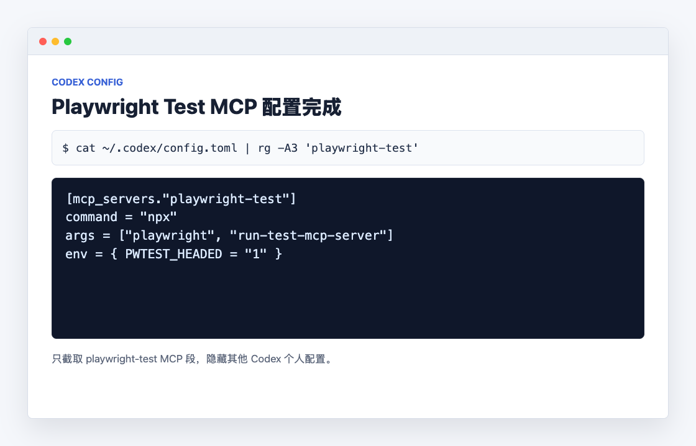
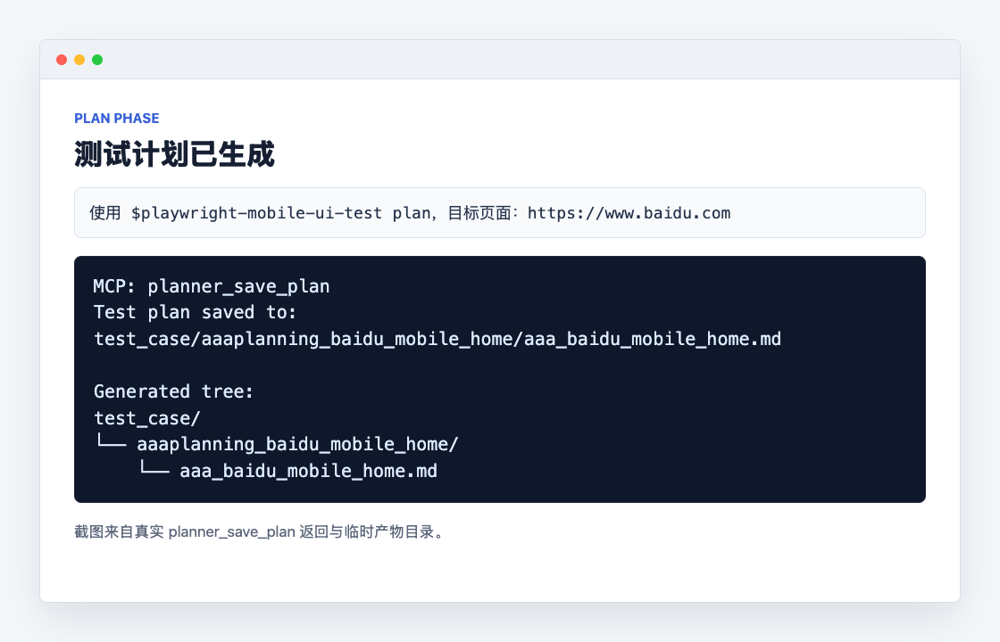
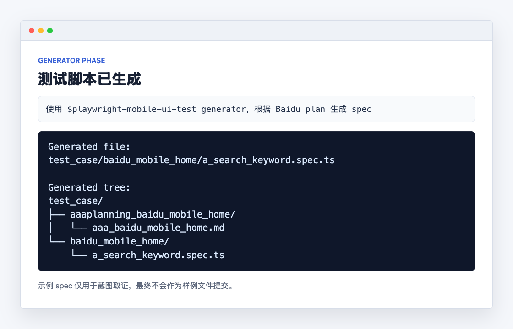
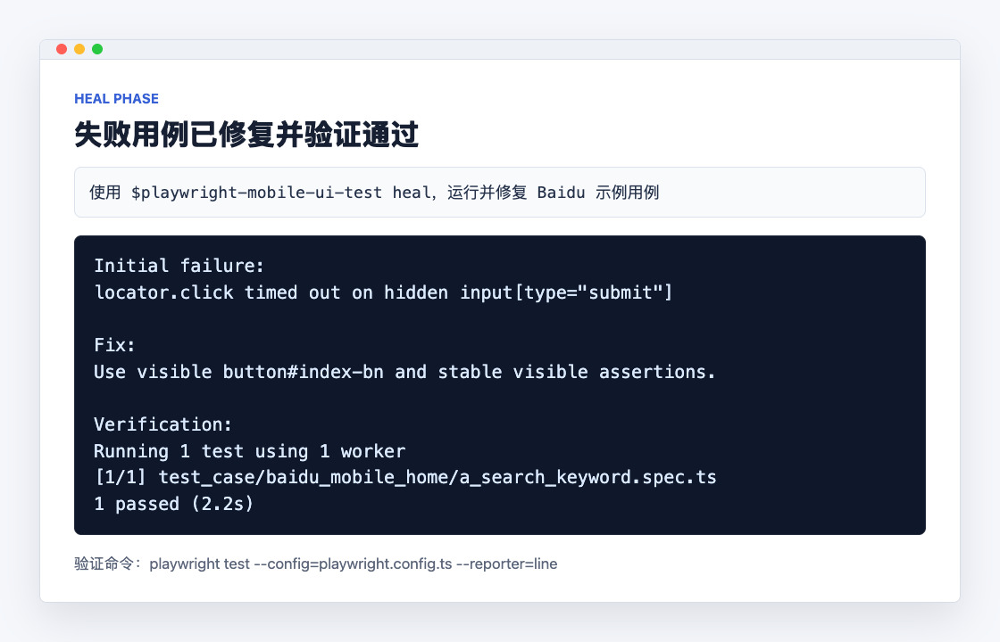

# Playwright Mobile UI Test Skill

用于在 Codex 中完成移动端 UI 自动化测试的三类任务：

- `plan`：探索页面并生成测试计划
- `generator`：根据测试计划生成 Playwright 测试脚本
- `heal`：运行、调试并修复失败测试

## 1. 安装 Skill

将本目录复制到 Codex 的 skills 目录：

```bash
mkdir -p ~/.codex/skills
cp -R skills/playwright-mobile-ui-test ~/.codex/skills/
```

安装后，新建或重启 Codex 会话，确保可以通过 `$playwright-mobile-ui-test` 触发该 skill。

## 2. 配置固定版本的 Playwright Test MCP

本 Skill 统一使用 **Playwright v1.61.1**。被测项目也应使用完全相同的版本：

```bash
npm install --save-dev --save-exact @playwright/test@1.61.1
npx --yes playwright@1.61.1 --version
```

版本检查应输出 `Version 1.61.1`。MCP 启动命令必须显式指定版本，不得使用未带版本号的 `playwright`、`playwright@latest` 或其他版本。

在 `~/.codex/config.toml` 中加入：

```toml
[mcp_servers."playwright-test"]
command = "npx"
args = ["--yes", "playwright@1.61.1", "run-test-mcp-server"]
env = { PWTEST_HEADED = "1" }
```

保存后重启 Codex，或重新加载当前窗口，使 MCP 服务生效。

配置完成后，Codex 配置中应能看到 `playwright-test` MCP：



## 3. 执行 Plan

在 Codex 中输入：

```text
使用 $playwright-mobile-ui-test plan
目标页面：https://www.baidu.com
视口：移动端
目标：验证首页搜索流程，包括打开首页、输入关键词、点击“百度一下”、检查结果页。
```

常见产物：

```text
test_case/aaaplanning_baidu_mobile_home/aaa_baidu_mobile_home.md
```

执行后会生成测试计划文件：



## 4. 执行 Generator

在 Codex 中输入：

```text
使用 $playwright-mobile-ui-test generator
根据 test_case/aaaplanning_baidu_mobile_home/aaa_baidu_mobile_home.md 生成 Playwright 测试脚本。
```

常见产物：

```text
test_case/baidu_mobile_home/a_search_keyword.spec.ts
```

执行后会生成对应的 Playwright spec 文件：



## 5. 执行 Heal

在 Codex 中输入：

```text
使用 $playwright-mobile-ui-test heal
运行当前项目 Playwright 测试，并修复失败用例。
```

执行后会运行测试、定位失败原因、修复用例并再次验证：



> Baidu 示例中的 plan/spec 文件仅用于截图演示最终产物位置，不随本 skill 作为样例文件提交。

## 6. Baidu 页面成果

以下截图为使用 Playwright 真实访问 `https://www.baidu.com`，并以移动端视口截取的页面成果：


截图参数：

```text
URL: https://www.baidu.com
Viewport: 390 x 844
Browser: Chrome
```
